```{=html}
<script>
document.addEventListener("DOMContentLoaded", () => {
  const banner = document.querySelector(".quarto-title-block .quarto-title-banner");
  const title  = document.querySelector(".quarto-title-block .title");
  if (!banner || !title) return;

  const H_MAX = 240;
  const H_MIN = 56;
  const RANGE = 260;

  banner.style.height = H_MAX + "px";

  function onScroll(){
    const s = Math.min(window.scrollY, RANGE);
    const t = s / RANGE;
    const h = Math.round(H_MAX - (H_MAX - H_MIN) * t);

    banner.style.height = h + "px";
    if (h <= H_MIN + 2) banner.classList.add("is-collapsed");
    else banner.classList.remove("is-collapsed");
  }

  window.addEventListener("scroll", onScroll, { passive: true });
  onScroll();
});
</script>
```

```{r}
#| include: false
source("Script.R")
```

# Introduzione

L'obiettivo del progetto è quello di analizzare un dataset reale relativo al funzionamento di una turbina a gas per la produzione di energia elettrica situato in Turchia. Il dataset considerato include misurazioni **orarie** relative a 11 parametri di diversa natura, tra cui variabili *ambientali*, *operative* e indicatori delle *emissioni* inquinanti.

Dopo una breve analisi descrittiva delle variabili si intede procedere con un'Analisi delle Componenti Principali (PCA), allo scopo di ridurre la dimensionalità dei dati ed identificare gli assi di massima variabilità associati al nostro set di dati. Successivamente, mediante diverse tecniche di cluster analysis, verranno individuati gruppi che presentano condizioni operative simili.

L’approccio adottato consente di distinguere differenti regimi di funzionamento della turbina, evidenziando quelle che sono le condizioni operative efficienti e inefficienti.

Il dataset utilizzato può essere scaricato dal seguente link: [Gas Turbine CO and NOx Emission Data Set](https://archive.ics.uci.edu/dataset/551/gas+turbine+co+and+nox+emission+data+set). Noi utilizzeremo i dati più recenti, ovvero quelli relativi all'anno 2015.

# Come funziona una turbina a gas?

<center>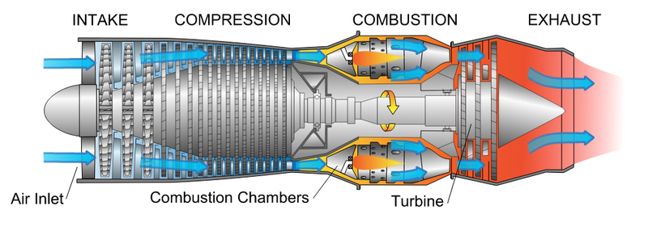</center>

Per capire appieno le variabili del dataset ed interpretare correttamente le successive analisi statistiche è utile descrivere, seppur in modo sintetico, il funzionamento di una turbina a gas.

Le turbine a gas sono motori che, tramite la combustione di specifici gas, solitamente metano (CH4), trasformano l'**energia termica** in **energia meccanica** e successivamente (attraverso la rotazione di turbine) in **energia elettrica**. Sebbene le turbine a gas trovino applicazione anche in ambito aeronautico e ferroviario, nel presente lavoro l’attenzione è rivolta esclusivamente al loro impiego per la produzione di energia elettrica.

Una turbina a gas si compone principalmente di 3 parti:

-   **Il compressore**: L’aria viene aspirata dall’esterno e convogliata in un compressore, dove la sua pressione e la sua temperatura aumentano. Questa fase è fondamentale per garantire una combustione efficiente del combustibile.

-   **La camera di combustione**: L’aria compressa entra nella camera di combustione, dove viene miscelata con il combustibile e incendiata. La combustione produce gas ad altissima temperatura e pressione, sprigionando una grande quantità di energia termica.

-   **La turbina**: I gas caldi prodotti dalla combustione permettono alla turbina di ruotare. L’energia termica dei gas viene così convertita in energia meccanica. Parte di questa energia serve ad alimentare il compressore, mentre la restante parte viene utilizzata per azionare un generatore elettrico.

Al termine del processo, i gas combusti vengono espulsi attraverso lo scarico della turbina.

L’intero processo genera delle **emissioni**, come il monossido di carbonio (CO) e gli ossidi di azoto (NOx).

Durante il funzionamento, numerosi sensori monitorano le condizioni operative (pressioni, temperature, portata d’aria) e le emissioni inquinanti prodotte dalla combustione, come il monossido di carbonio (CO) e gli ossidi di azoto (NOx). Queste misure costituiscono le variabili analizzate nel dataset oggetto di studio.

## Il processo di combustione

Abbiamo già detto che nelle turbine a gas l’energia viene prodotta attraverso un processo di combustione, durante il quale un combustibile gassoso, nel nostro caso il metano, **reagisce con l’ossigeno contenuto nell’aria**. Questa reazione libera energia sotto forma di calore, che viene successivamente trasformata in energia meccanica e poi in energia elettrica.

### La combustione completa

La combustione si definisce **completa** quando il metano riesce a bruciare interamente, <u>grazie alla presenza di una quantità sufficiente di ossigeno e a temperature adeguatamente elevate.</u> In queste condizioni, il combustibile viene trasformato quasi esclusivamente in anidride carbonica (CO2) e vapore acqueo (H20), con una **produzione efficiente di energia** e con emissioni di monossido di carbonio (CO) molto contenute. Il metano (CH4), infatti, brucia solo se trova abbastanza ossigeno nell’aria. Se c’è abbastanza ossigeno allora ogni atomo di carbonio può legarsi completamente all’ossigeno mentre se l’ossigeno è poco il carbonio si ferma a metà e si forma CO.

Per ossidare completamente una molecola di metano servono 2 molecole di ossigeno, si ottiene così anidride carbonica e vapore acqueo. In questo caso **l'energia che si libera è massima**. Se è presente una quantità inferiore di due molecole di ossigeno per ogni molecola di metano allora questo non si ossida completamente e si forma del monossido di carbonio (un inquinante) e la quantità di energia sprigionata è minore.

Schema di combustione completa: \begin{equation}
\mathrm{CH_4 + 2\,O_2 \rightarrow CO_2 + 2\,H_2O + energia}
\end{equation}

### La combustione incompleta

Al contrario, si parla di combustione **incompleta** quando le condizioni non sono ottimali, ad esempio <u>in presenza di temperature più basse o di una miscelazione non ideale tra aria e combustibile.</u> In tali situazioni, il metano non viene ossidato completamente e si formano **prodotti intermedi**, in particolare il monossido di carbonio (CO), con una conseguente riduzione dell’energia prodotta.

In generale l'intensità e la qualità della combustione sono direttamente legate alla temperatura dei gas all’ingresso della turbina: valori più elevati di questi indicano una combustione più intensa e completa, mentre valori più bassi sono associati a condizioni di combustione meno efficienti (maggiore monossido di carbonio).

All’interno di una turbina a gas, l’obiettivo è mantenere la combustione il più possibile completa e stabile, in modo da massimizzare l’energia prodotta e **ridurre le emissioni di CO**. Temperature di combustione più elevate e una corretta quantità di aria favoriscono una combustione completa, mentre condizioni operative non ottimali possono portare a fenomeni di combustione incompleta.

Il compressore di una turbina gioca quindi un ruolo fondamentale perché più l'aria è compressa, più molecole di ossigeno conterrà e più sarà intensa e quindi efficiente la combustione (emissioni contenute di monossido di carbonio). Oltre al danno ambientale causato, la combutione incompleta è inefficiente perchè parte del combustibile che sarebbe potuto essere stato convertito in energia elettrica viene sprecato.

Schema di combustione incompleta: \begin{equation}
\mathrm{CH_4 + \tfrac{3}{2}\,O_2 \rightarrow CO + 2\,H_2O + energia}
\end{equation} Vediamo come in questo caso siano presenti meno di due molecole di ossigeno per ogni molecola di metano. La combustione produce comunque energia **ma in misura minore rispetto a quando la combustione è completa**, più il monossidio di carbonio come abbiamo più volte detto. Questo è un male per l'ambiente, poichè, sebbene l'anidride carbonia contribuisca al surriscaldamento globale non è un gas tossico (è un gas serra) mentre il monossido di carbonio è altamente tossico e può causare avvelenamento e morte.

# Analisi descrittiva

Come abbiamo già detto, il dataset include misurazioni orarie relative a 11 parametri di diversa natura. Un anno è composto da 8760 ore, tuttavia, la turbina non è stata operativa initterottamente. I dati raccolti hanno infatti registrato **7384** ore di funzionamento (poco più di 300 giorni) questa informazione, dal punto di vista statistico, rappresenta la nostra **numerosità campionaria**.

## Le variabili

```{r}
oss10
```

<br> La prima riga include la rilevazione delle variabili oggetto di interesse durante la **prima ora di funzionamento della turbina a gas** nell'anno 2015 (o meglio, una loro **media**), la seconda quelle durante la sua seconda ora di funzionamento e così via.

Andiamo ora a descrivere le variabili una ad una e le unità di misura in cui sono espresse.

```{r}
kable(
  tab_testo,
  caption = "Descrizione delle variabili",
  escape = FALSE,
  format = "html"
) |>
  kable_styling(full_width = FALSE) |>
  column_spec(4, width = "4cm")
```

## Statistiche descrittive

```{r}
desc_table |>
  mutate(across(where(is.numeric), ~round(., 3))) |>
  kable(
    col.names = c(
      "",
      "Media", "Mediana", "Varianza", "DevStd",
      "Q1", "Q3", "Asimmetria", "Curtosi"
    ),
    booktabs = TRUE,
    align = "lcccccccc",
  ) |>
  kable_styling(
    full_width = FALSE,
    position = "center"
  ) |>
  column_spec(
    1,
    border_right = TRUE
  )
```

La tabella riassume le principali statistiche descrittive delle variabili considerate nello studio della turbina a gas. Nel complesso, le variabili mostrano scale di misura e livelli di variabilità eterogenei, necessitando pertanto di una preventiva **standardizzazione** prima dell’applicazione delle tecniche di clustering.

Le variabili AT (temperatura ambiente), AP (pressione atmosferica) e AH (umidità relativa) presentano valori medi e mediani molto simili, indicando distribuzioni sostanzialmente **simmetriche** e assenza di forti distorsioni.

Le variabili legate al funzionamento della turbina, quali AFDP, GTEP e CDP, mostrano una dispersione relativamente contenuta e valori di asimmetria prossimi allo zero.

Le temperature interne della turbina (TIT, TAT e TEY) evidenziano una variabilità più marcata. In particolare, TAT mostra una forte asimmetria negativa e un’elevata curtosi, suggerendo la presenza di osservazioni estreme e una distribuzione fortemente concentrata con code pronunciate.

Infine, le variabili di emissione, CO e NOX, risultano caratterizzate da un’elevata asimmetria positiva e da valori di curtosi molto elevati, soprattutto nel caso del CO. Ciò indica la presenza di picchi occasionali di emissioni.

Nel complesso, l’analisi descrittiva mette in evidenza la presenza di distribuzioni non gaussiane e di valori estremi per alcune variabili, confermando la necessità di utilizzare metodologie di clustering robuste.

## Densità {#densità}

```{r}
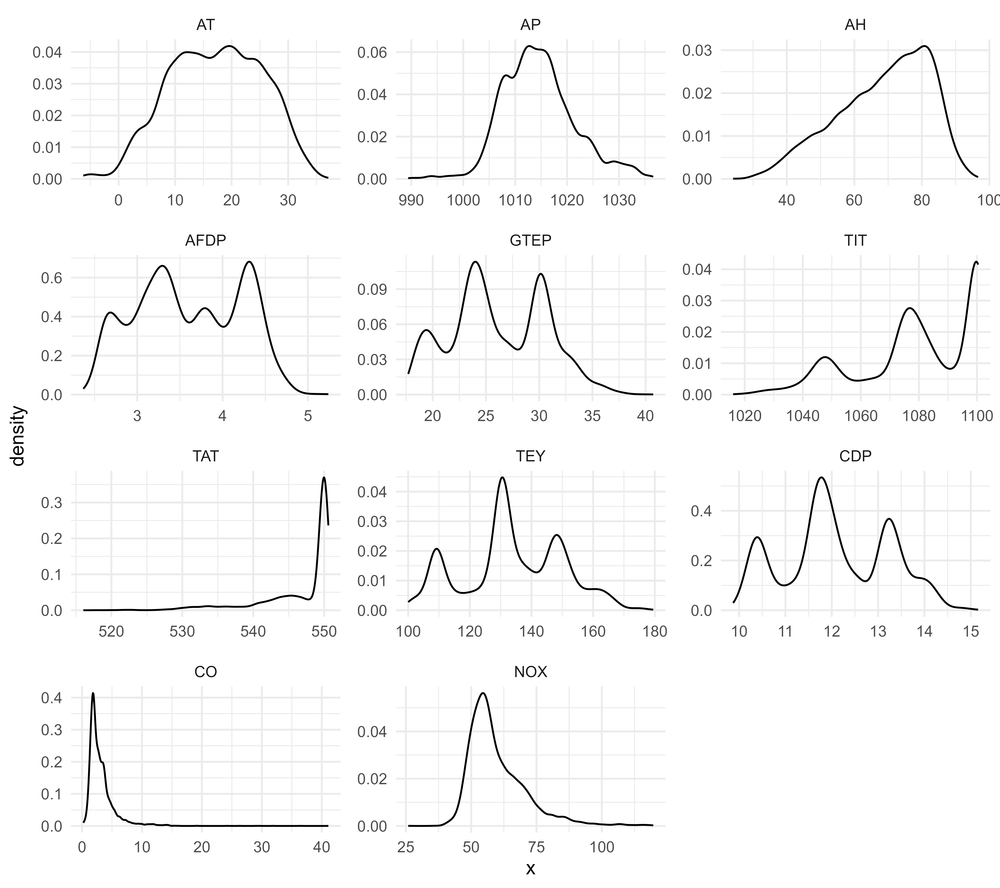
```

Da come possiamo notare la maggior parte delle distribuzioni **sono ben lontane a quella di una gaussiana**. Ipotesi richiesta qualora volessimo applicare tecniche di clustering come il GMM, motivo per cui è necessaria molta cautela nell'approcciare modelli di questo tipo. L'ipotesi di normalità, infatti, è poco plausibile perchè le distribuzioni presentano **asimmetrie**, **valori estremi** e **multimodalità**.

Per quanto riguarda la distribuzione della variabile AT, ad esempio, questa sembra essere molto "ampia", con una maggiore concentrazione di osservazioni nella parte centrale e code più sottili agli estremi. Sebbene sia una delle poche distribuzioni qui presenti a richiamare quella di una gaussiana non possiamo affermare che lo sia. La distribuzione di AP, al contario, appare più concentrata rispetto il suo valore medio.

Altre variabili come AFDP, GTEP, TIT, TEY e CDP presentano distribuzioni multimodali in quanto sono chiamarmente visibili **più di due picchi** in oguna di esse. Questo perchè come vedremo la turbina a gas opera sotto differenti condizioni e regimi.

Riguardo la variabile CO, la sua distribuzione è fortemente asimmetrica a destra, con un’elevata densità per valori molto bassi e una lunga coda verso valori elevati. Questo indica la presenza di pochi eventi estremi rispetto alla maggioranza delle osservazioni. TAT invece è fortemente asimmetrica a sinistra.

Per NOX osserviamo un picco principale ben definito e una coda destra pronunciata. Anche in questo caso l’asimmetria suggerisce la presenza di valori elevati occasionali rispetto al livello tipico.

## Box-Plot

```{r}
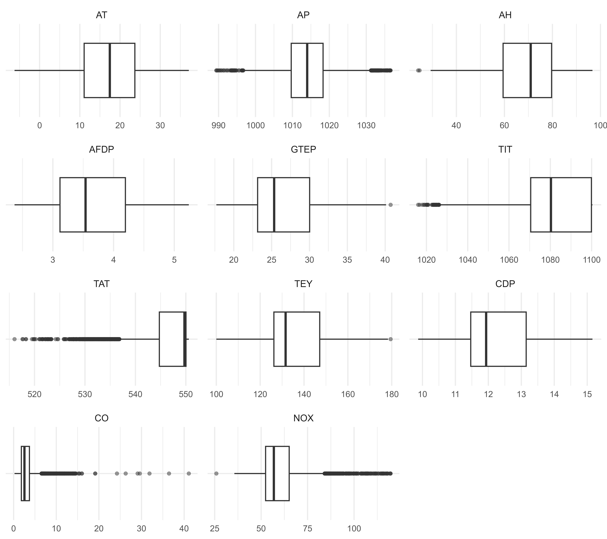
```

L'analisi dei Box-Plot mette in evidenza quanto abbiamo già visto con le distribuzioni di densità. Sono chiaramente visibili **asimmetrie**, **dispersione** e **presenza di outlier** in molte variabili.

Il Box-Plot che risulta essere più "equilibrato" sotto questo punto di vista è quello di AT, infatti, la sua dispersione è moderata e presenta pochi valori estremi. La mediana è ben centrata all’interno dell’intervallo interquartile. Una situazione meno ottimale si osserva invece nei boxplot delle variabili di AH, AFDP, GTEP e TEY. Per AP sono presenti diversi outlier sia nella parte inferiore sia in quella superiore della distribuzione, indicando episodi di pressione dell'aria anomala rispetto al valore tipico. Per TAT invece la distribuzione è fortemente asimmetrica, con una grande quantità di outlier verso valori più bassi e una concentrazione dei dati vicino al limite superiore. Cosa molto simile si verifica per NOX dove abbiamo una coda destra molto pronunciata e numerosi outlier.

Anche in questo caso dobbiamo procedere con cautela prima di applicare tecniche di clustering come il *k-means*. L'eterogeneità delle varibiali e le diverse unità di misura in cui sono espresse richiede una preventiva standardizzazione delle stesse. Le asimmetrie e la presenza di outlier invece suggeriscono ulteriore prudenza: essendo il k-means basato sulla minimizzazione della devianza within all'interno di ciascun cluster rispetto il suo centroide, esso è sensibile ai valori estremi. Per questo motivo potrebbe essere opportuno considerare l’applicazione di tecniche di clustering più robuste.

## La matrice delle correlazioni

```{r}
#| out-width: "85%"
#| fig-align: center
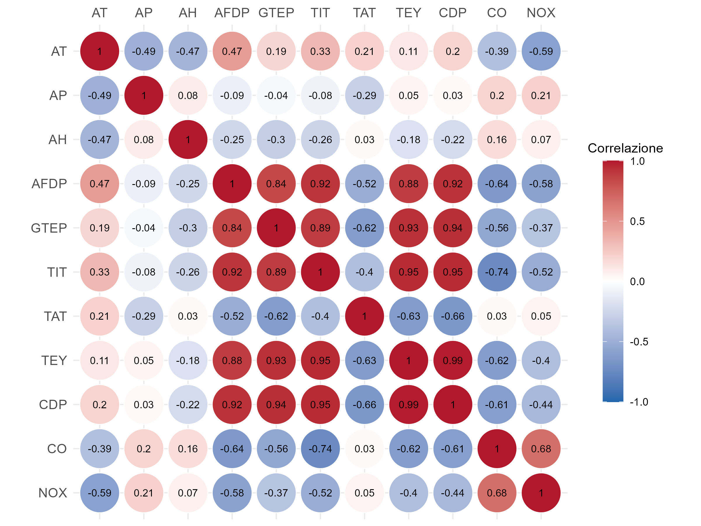
```

Focalizziamoci ora sulle variabili maggiormente correlate, prima positivamente, poi negativamente, ed andiamo a caprine le ragioni:

```{r}
#| results: asis
tabella <- data.frame(
  Scatter = c(
    "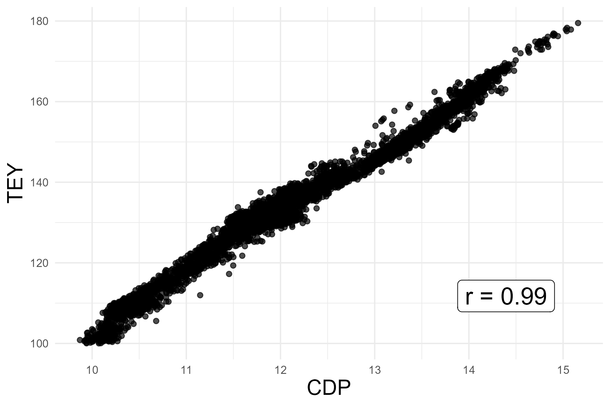",
    "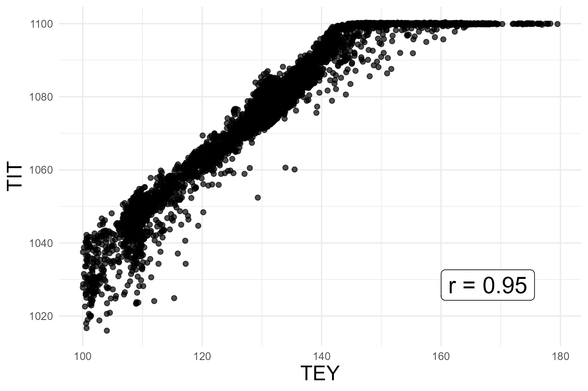",
    "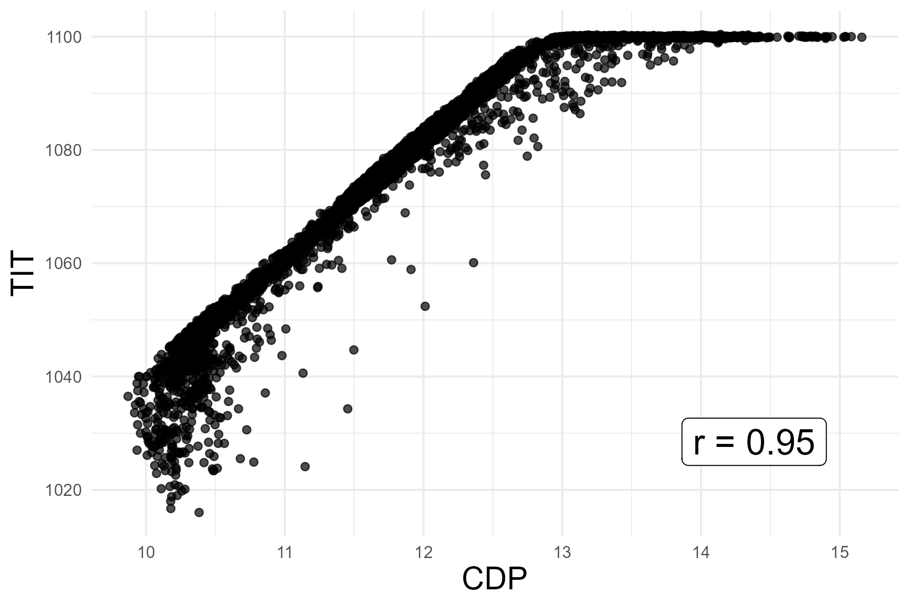",
    "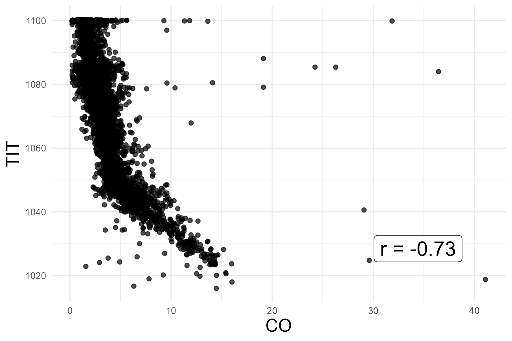",
    "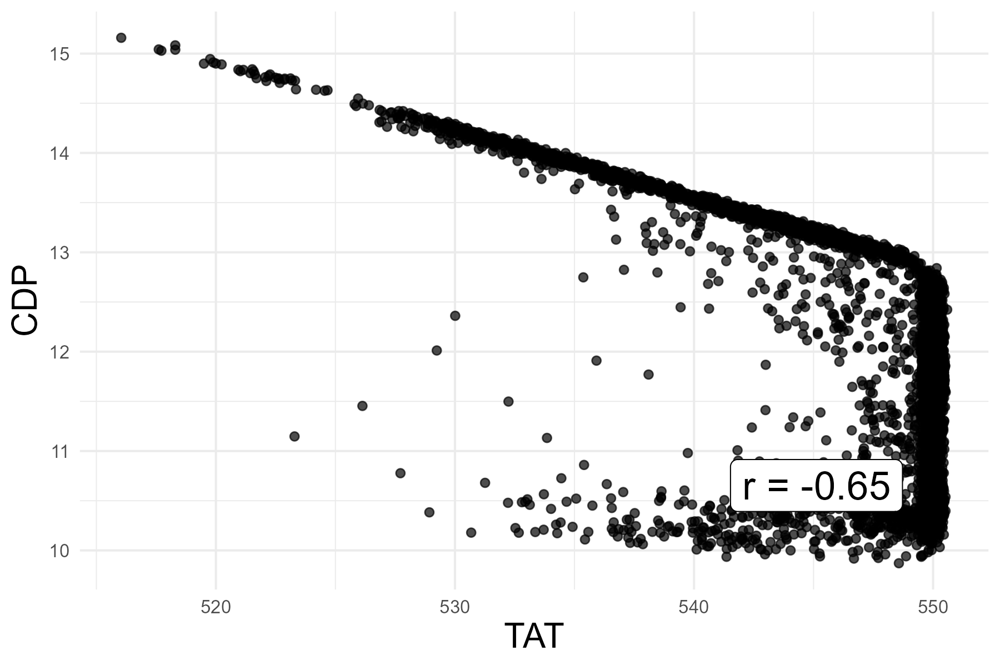",
    "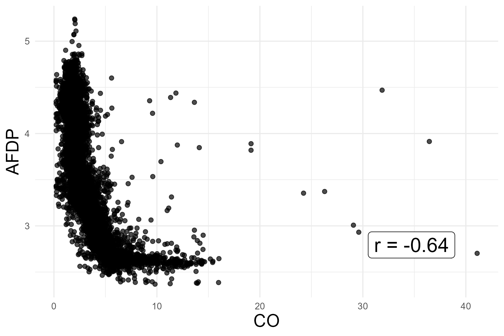"
  ),
  Descrizione =c("Come già discusso, la variabile CDP esprime la pressione dell’aria misurata in uscita dal compressore, immediatamente prima dell’ingresso nella camera di combustione, mentre TEY rappresenta la quantità di energia elettrica prodotta dalla turbina. Le due variabili sono fortemente correlate, al punto che la conoscenza di una di esse ci consente di predirre quasi perfettamente anche l’altra. Questo legame sussiste perché, quanto più elevata è la pressione dell’aria in uscita dal compressore, tanto maggiore è la quantità di ossigeno disponibile per la combustione, permettendo di bruciare una maggiore quantità di combustibile e di produrre, di conseguenza, una maggiore quantità di energia elettrica.",
                 "L'energia prodotta dalla turbina TEY risulta essere fortemente correlata anche con la variabile TIT ovvero la temperatura dei gas di combustione quando questi arrivano alla turbina. Questo legame statistico è spiegato dal legame fisico esistente tra questi variabili. TIT, infatti, esprime in un certo senso l'energia termica mentre TEY l'energia eletterica. La loro correlazione ci aiuta a capire quanta parte dell'energia termica viene convertita in energia elettrica. Più è alta la temperatura dei gas, e quindi l'energia termica, più intenstamente girerà la turbina. La rotazione più intensa della turbina si traduce in un incremento dell’energia meccanica e, di conseguenza, in una maggiore produzione di energia elettrica.", 
                 "L'ultima correlazione con segno positivo che si vuole analizzare è quella tra la variabile CDP e TIT. Notiamo che l'aria compressa, pronta per essere combusta, è altamente correlata anche con la temperatura dei gas dopo la combustione, in arrivo alla turbina. Questo perché una maggiore pressione dell'aria porta ad una maggiore intensità della combustione quindi la temperatura dei gas che arriveranno alla turbina sarà chiaramente più alta.", 
                 "Qui possiamo ricollegarci al concetto di combustione incompleta. Una volta compreso questo capiamo subito che se la temperatura dei gas combusti è elevata allora la combustione può definirsi completa, si libera infatti un quantitativo maggiore di energia perchè l'ossigeno presente è sufficiente per l'ossidazione del metano e si forma anidride carbonica (non monossido di carbonio, CO). Mentre se la temperatura di questi gas è più bassa la combustione è incompleta, la quantità di energia che si libera è inferiore, perchè le molecole di carbonio non sono riuscite tutti a legarsi ad una molecola di ossigeno e per questo si hanno più emissioni di monossido di carbonio (CO).", 
                 "Ritroviamo ancora una volta la pressione dell'aria in uscita dal compressore CDP con una nuova variabile TAT, questa indica la temperatura dei gas di scarico, cioè la temperatura dei gas esplusi dalla turbina a gas e la si può interpretare anche come l'energia termica residua. Queste variabili sono negativamente correlate perché più la turbina lavora intenstamente più aria comprime, maggiore quindi sarà la quantità di energia termica convertita in energia elettrica, di conseguenza la temperatura dei gas di scarico e quindi l'energia termica residua sarà inferiore.", 
                 "Per spiegare quest'ultima correlazione potremmo ricollegarci anche qui alla combustione completa ed incompleta. Alla base del compressore vi è un filtro, questo si occupa di eliminare tutte le particelle esterne che potrebbero creare problemi alla macchina. La differenza di pressione tra l'aria ambienete e la pressione dell'aria una volta che questa viene filtrata è misurata da AFDP. Questa è negativamente correlata con il monossido di carbonio, perchè più la differenza di pressione è alta più aria passa nella turbina quindi la combustione sarà completa e l'emissione di CO diminuisce."),
  check.names = FALSE
)

kable(tabella, escape = FALSE, format = "html",
      col.names = c("Scatter plot", "Descrizione")) |>
  kable_styling(full_width = FALSE, position = "left", bootstrap_options = "none") |>
  column_spec(1, width = "8cm") |>
  column_spec(2, extra_css = "text-align: justify;") |>
  row_spec(0, bold = TRUE)

```

## La matrice degli scatter plot

```{r}
knitr::include_graphics("plots/matricesp.png")
```

# Cluster Analysis

## Il K-means nello spazio originario

Il K-means è un algoritmo di clustering non supervisionato (il cui numero di cluster cioè non è noto a priori) che mira a suddividere un insieme di $n$ osservazioni in $K$ gruppi disgiunti, in modo tale da minimizzare la variabilità interna (devianza within) ai cluster. Dopo aver inizializzato i centroidi l'algoritmo assegna le unità statistiche al centroide che gli risulta essere più vicino, in seguito, le medie vengono aggiornate e le unità riassegnate fino a quando l'algoritmo non converge. I principali limiti del k-means è che assume implicitamente **cluster sferici**. In più non permette di modellare la struttura di varianza e covarianza delle variabili appartenenti al set di dati, dando per scontato che i gruppi abbiano varianza uguale e correlazione nulla. Pertanto, l'unico elemento che distingue i gruppi sono le medie. Motivo per cui, se vi sono i presupposti, si ricorre a tecniche di clustering più avanzate come il GMM.

La scelta del numero di cluster $K$ è stata effettuata utilizzando il metodo del gomito, che analizza l’andamento della devianza within (within-cluster sum of squares) al variare di $K$.

Come mostrato nella figura, la devianza within decresce rapidamente per piccoli valori di $K$, mentre la riduzione diventa progressivamente meno significativa all’aumentare del numero di cluster. In particolare, si osserva un cambiamento di pendenza marcato intorno a $K=3$, suggerendo che tale valore rappresenti una buona scelta.

```{r, fig.align="center", fig.width=14, fig.height=8, warning=FALSE, echo=FALSE}
kmeansPlot
```

Tra la scelta di un cluster e due si verifica una diminuzione della devianza within maggiore a 3 milioni, tra il secondo ed il terzo otteniamo un'ulteriore diminuzione pari a circa un milione. Dal quarto in poi questa dimunzione non giustifica più l'aumento del numero di gruppi.

Essendo le variabili espresse in unità di misura differenti il K-means è stato effettuato su variabili standardizzate. I centroidi ottenuti sono stati successivamente riportati alla scala originale tramite una trasformazione inversa utilizzando le medie e le deviazioni standard delle variabili originali.

Qui di seguito si riportano i centroidi dei 3 cluster, ovvero i vettori contenenti le medie delle variabili calcolate sulle sole osservazioni appartenenti ai rispettivi gruppi.

```{r, echo=FALSE}
kable(
  centroidi_df2,
  escape = FALSE,
  align = c("c", rep("r", ncol(centroidi_df2) - 1))) |>
  kable_styling(full_width = FALSE) |>
  column_spec(1, border_right = TRUE) |>
  row_spec(0, extra_css = "border-bottom: 1px solid black;  text-align: center;")

```

## La tandem Analysis

La tandem analysis è una procedura **sequenziale** che prevede la riduzione della dimensionalità del nostro set di dati (riduzione cioè del numero di colonne della matrice dei dati) e successiva riduzione delle righe (applicando una tecnica di clustering come il k-means). È sequenziale perchè si procede "a step", prima si riduce la dimensionalità dei dati e poi si usa un algoritmo di clustering per individuare gruppi di unità.

### L'analisi delle componenti principali

L'analisi delle componenti principali (ACP) è una tecnica di **riduzione della dimensionalità** il cui obiettivo è sintetizzare al meglio l'informazione contenuta nelle $p$ variabili della matrice dei dati, riducendone in modo significativo il numero. Le nuove variabili, che chiamiamo “componenti principali” saranno ottenute come **combinazione lineare** delle $p$ variabili di partenza e saranno tra loro **incorrelate**. Ridurre la dimensionalità dell’insieme dei dati è solitamente possibile perché la correlazione tra variabili crea una ridondanza di informazioni.

Una combinazione lineare di queste variabili adempie al meglio ai propri scopi quando è di *massima variabilità*. Tanto più è elevata la variabilità, infatti, tanto più saranno le informazioni che si è stati in grado di preservare.

Per valutare quanta informazione viene catturata da ciascuna componente principale, è stata analizzata la percentuale di varianza spiegata dall'ACP. Il grafico seguente mostra la quota di varianza spiegata da ogni componente principale, consentendo di individuare il numero di componenti necessarie a rappresentare adeguatamente la struttura dei dati.

```{r}
#| fig-align: center
#| fig-width: 8
#| fig-height: 5
graficoPCA
```

Qui di seguito si riporta invece una tabella riassuntiva delle devazioni standard e delle percentuali di varianza spiegata da ciascuna delle componenti, più la percentuale di varianza spiegata cumulata, utile per la scelta del numero dei fattori.

```{r, echo=FALSE}
kable(round(summary(pca)$importance, 3)) |>
  kable_styling(full_width = FALSE) |>
  column_spec(1, border_right = TRUE) |>
  row_spec(2, extra_css = "border-bottom: 1px solid black;")
```

#### Scelta del numero di componenti

Indipendentemente dal criterio di scelta, quasi sempre si andranno a prelevare non più di **due componenti principali**, scegliendo quelle con la percentuale massima di variabilità spiegata, altrimenti la rappresentazione grafica dei punti individuo diverrebbe più complessa (nel caso di tre componenti) o impossibile (più di tre componenti). Nel nostro caso optare per due componenti è comunque un'ottima scelta perché coerente con lo *scree test criterion* (secondo cui si scelgono tante componenti fino a che non si verifica una regolarizzazione dell'istogramma) e l'*eigenvalue one criterion*. Essendo infatte le variabili standardizzate, la varianza di ognuna di esse è pari ad 1. Pertanto, non ha senso scegliere componenti la cui varianza è inferiore dell'unità perchè spiegherebbero meno rispetto le variabili originali. La percentuale di varianza spiegata (e quindi la percenutale di informazione che si è stati in grado di preservare) nel nostro caso è pari al **74%**

#### Rappresentazione grafica dei punti individuo

Una volta calcolati gli autovettori associati alla matrice di correlazione possiamo utilizzare questi per proiettare le unità statistiche nel nuovo spazio di dimensione ridotta:

```{r}
#| fig-align: center
#| fig-width: 10
#| fig-height: 6
PC1PC2
```

Per completezza dell’analisi, si riportano di seguito i grafici delle proiezioni dei dati su tutte le combinazioni possibili delle prime quattro componenti principali (PC1–PC4). Tali rappresentazioni consentono di esplorare visivamente le relazioni tra le unità statistiche lungo le diverse direzioni di massima variabilità.

```{r}
#| fig-align: center
#| fig-width: 12
#| fig-height: 8
p13 <- make_plot("PC1", "PC3")
p23 <- make_plot("PC2", "PC3")
p14 <- make_plot("PC1", "PC4")
p34 <- make_plot("PC3", "PC4")

(p13 | p23) / (p14 | p34)
```

#### La nomina dei fattori

Le componenti principali non hanno un significato di per sè, essendo dimensioni "astratte" . Per questo utilizziamo il cerchio delle correlazioni, esso permette di mostrare la **correlazione** che sussiste tra le variabili originali del dataset e la correlazione tra variabili e fattori. L’angolo che ciascun vettore forma con l’asse di una componente principale indica il grado di correlazione tra la variabile originale e la componente stessa: se i vettori (che rappresentano variabili) sono allineati all’asse della componente allora risultano fortemente correlati, mentre vettori ortogonali indicano una correlazione debole o nulla. Abbiamo poi i contributi, che misurano quanto una variabile è imporante nel costruire una componente.

```{r}
#| fig.align: "center"
#| fig.width: 7
#| fig.height: 7

fviz_pca_var(pca,
             title = "PCA - Il cerchio delle correlazioni",
             col.var = "contrib",  # colore in base al contributo
             gradient.cols = c("blue", "yellow", "red"),
             repel = TRUE,
             labelsize = 6,
             ggtheme = theme_minimal(base_size = 15)
)
```

#### La prima componente

Le variabili che presentano il contributo più alto rispetto le prime due dimensioni di massima variabilità sono CDP, GTEP, TEY, TIT e AFDP. Queste sono anche le variabili che risultano essere meglio rappresentate nello spazio e allo stesso tempo maggiormente correlate con il primo fattore. Ciò significa che per la sua interpretazione dovremmo fare riferimento a queste. Quella con il coefficiente di correlazione più alto è AFDP. La differenza di pressione tra l'aria ambienete e quella dopo il passaggio nel filtro è bassa nel momento in cui l'aria aspirata è poca (incontra poca resistenza e l'attrito è alto), mentre comincia a salire quando l'aria aspirata aumenta (questo perchè vi è maggiore resistenza opposta con un aumento di attrito). TEY è il prodotto del processo di produzione (l'energia elettrica) mentre TIT la temperatura dei gas di combustione.

Alla luce di quanto detto finora, e su ciò che già sappiamo, possiamo affermare che la prima componente principale rappresenta l'**intensità operativa della turbina** (cioè quanto questa "lavora"). Infatti, più ci spostiamo lungo il primo asse, maggiore sarà lo sforzo a cui la turbina a gas è sottoposta (aspira più aria, il compressore spinge di più, i gas combusti sono più caldi, la turbina gira più velocemente e l’output energetico è maggiore). Notiamo inoltre una <u>forte correlazione negativa</u> con le emissioni dei gas di scarico (in particolare monossido di carbonio). Segno che quando la turbina è al massimo delle sue capacità (la si fa cioè "lavorare"), aumenta la sua efficienza, perché si riesce a completare la combustione del metano e le emissioni sono ridotte.

```{r, fig.align="center", warning=FALSE, fig.width=7, fig.height=2, echo=FALSE}
pc_scores <- pca$x
cor_pc <- cor(dati_scaled, pc_scores, use = "complete.obs")

# seleziona solo PC1 e PC2
cor_pc_sub <- cor_pc[, c("PC2", "PC1")]

cor_pc_t <- t(cor_pc_sub)

vars_order <- colnames(gt_2015)   # oppure colnames(dati_scaled)

corr_melt <- melt(cor_pc_t)
colnames(corr_melt) <- c("Componente", "Variabile", "value")

corr_melt$Componente <- factor(corr_melt$Componente, levels = c("PC2", "PC1"))


corr_melt$Variabile <- factor(
  corr_melt$Variabile,
  levels = vars_order
)

ggplot(corr_melt, aes(x = Variabile, y = Componente, fill = value)) +
  geom_point(
    shape = 21,
    size = 13,
    color = "white",
    stroke = 0.5
  ) +
  geom_text(aes(label = round(value, 2)), size = 4) +
  coord_equal() +
  scale_x_discrete(position = "top") +
  scale_fill_gradient2(
    low = "#2166AC",
    mid = "#FFFFFF",
    high = "#B2182B",
    midpoint = 0,
    limits = c(-1, 1)
  ) +
  guides(
    fill = guide_colorbar(
      title.position = "top",
      title.hjust = 0.01,
      barheight = unit(2.5, "cm"),
      barwidth  = unit(0.6, "cm")
    )
  ) +
  theme_minimal() +
  theme(
    axis.text.x = element_text(angle = 0, hjust = 0.5, vjust=0.5, size=12),
     axis.text.y = element_text(size = 12),
    axis.title  = element_blank(),
  legend.box.margin = margin(t = -27)  ) +
  labs(fill = "Correlazione")

```

#### La seconda componente

PC2 invece sembra essere molto correlata con le variabili ambientali esterne (il cui controllo cioè è limitato) e con TAT (la temperatura dei gas di scarico dopo aver attraversato la turbina) che ricordiamo è indicatrice della qualità della conversione dell'energia termica in meccanica e quindi eletterica. La seconda componente principale sembrerebbe quindi sintetizzare quelle che sono le cosidette **condizioni ambientali**. Più ci spostiamo in alto lungo l'asse PC2 più la temperatura dell'aria è bassa e maggiore è la sua pressione. Pertanto, all'<u>aumentare di PC2 le condizioni ambientali diventano favorevoli al processo di produzione dell'energia.</u> Mentre più ci spostiamo verso il basso più le condizioni ambientali sono sfavorevoli. Questo perchè un'aria fredda e ad alta pressione <u>conterrà un numero maggiore di molecole d'ossigeno</u> favorendo così il processo di combustione, rispetto all'aria calda e a bassa pressione, il cui numero di molecole di ossigeno è chiaramente inferiore.

### K-Means su spazio ridotto

```{r, fig.align="center", fig.width=10, fig.height=6, echo=FALSE}
graficoKMEANS
```

L'algoritmo separa abbastanza bene i punti rispetto quello che ci aspetteremmo intuitivamente guardando il grafico.

<ul style="margin-left:40px; list-style-type: &#39;- &#39;; padding-left:15px;">

<li>I punti appartenenti al <b>[cluster verde]{style="color:#145a32;"}</b> sono tutti punti in cui si registrano alti valori di PC1, cioè sono momenti in cui la turbina <u>lavora intensamente</u> per cui viene aspirata una maggiore quantità di aria, l'attività del compressore è elevata così come il quantitativo di energia elettrica prodotta, mentre la temperatura dei gas in uscita è bassa. Allo stesso tempo in tale cluster apparterranno anche i momenti in cui le condizioni ambientali sono <u>mediamente favorevoli</u>, ovvero momenti in cui la temperatura ambientale è fredda e la pressione dell'aria alta. Tutto ciò porta alla <u>completa combustione del carburante</u>, cioè del metano, e le emissioni di CO (monossido di carbonio) sono <u>molto contenute</u>. Questo cluster individua i momenti in cui la turbina lavora in **modo efficiente**.</li>

<br>

<li>Per i punti appartenenti al <b>[cluster blu]{style="color:#08306b;"}</b> invece la turbina <u>non lavora in modo particolarmente intenso</u>, ma neanche troppo poco. Le condizioni ambientali sono leggermente sfavorevoli e <u>si registrano valori intermedi per tutte le variabili operative</u>, inclusa l'energia elettrica prodotta. Le emissioni di CO <u>non sono basse ma neanche alte</u>. In questo cluster pertanto vi sono tutte le ore in cui la turbina lavora in modo **nè troppo efficiente nè troppo inefficiente (intermedio)**.</li>

<br>

<li>I punti appartenenti al <b>[cluster rosso]{style="color:#99000d;"}</b> fanno riferimento a tutte quelle ore in cui l'attività della turbina è <u>meno intensa</u> (bassi valori di PC1) viene cioè aspirata meno aria, la sua pressione all'interno della turbina è più bassa così come l'output energetico. La <u>temperatura dei gas di scarico è elevata</u> (molta dell'energia terminca non viene cioè convertita in energia meccanica) e sebbene le condizioni ambientali siano mediamente favorevoli la combustione è incompleta così che si generano molte emissioni di monossido di carbonio, in altre parole <u>molto del metano impiegato viene sprecato</u> e la quantità di energia elettrica prodotta è bassa. La turbina in questo caso lavora in **modo inefficiente**.</li>

</ul>

### K-median

Il K-median è una tecnica di clustering analoga al k-means ma caratterizzata dall’utilizzo della mediana anziché della media per onguno dei cluster. In particolare, ciascun cluster minimizza la somma delle **distanze assolute** tra le osservazioni e il suo centro (la mediana). Rispetto al k-means, il K-median risulta meno sensibile ai valori anomali e alle distribuzioni asimmetriche, rendendolo particolarmente adatto in presenza di dati rumorosi o non gaussiani. Nel nostro caso il risultato ottenuto è molto simile a quello del k-means e possiamo vederlo da questa figura:

```{r, fig.align="center", fig.width=10, fig.height=6, echo=FALSE}
graficoKmedian
```

### Fuzzy C-Means

Il Fuzzy C-Means (FCM) è una tecnica di clustering non supervisionato strettamente correlata al metodo k-means. A differenza di quest’ultimo, che produce un’assegnazione crisp delle unità statistiche a un unico cluster, il Fuzzy C-Means consente a ciascuna osservazione di **appartenere simultaneamente a più cluster**, con differenti gradi di appartenenza (membership).

L’algoritmo stima una **matrice di membership**, nella quale ogni elemento rappresenta il grado di appartenenza di una specifica unità a un determinato cluster. Per ciascuna osservazione, la somma delle membership associate ai diversi cluster è pari a uno. Tale vincolo permette di interpretare i valori di membership come una probablità di appartenenza delle unità statistiche ai cluster di riferimento.

```{r, fig.align="center", fig.width=10, fig.height=6, echo=FALSE}
graficoFCMCrisp
```

La figura di sopra mostra il risultato del Fuzzy C-Means rappresentato in forma crisp, ovvero assegnando ciascuna osservazione ad un UNICO cluster, cioè quello per il quale l'unità statistica presenta la membership più alta. Il colore identifica il cluster di appartenenza prevalente, mentre la dimensione dei punti (o meglio la loro opacità) riflette il grado di membership, fornendo un’indicazione della certezza dell’assegnazione. Tanto più il punto è scuro tanto più elevata è la sua memebrship rispetto il cluster a cui è stato assegnato.

```{r, fig.align="center", fig.width=10, fig.height=6, echo=FALSE}
fuzzyborder
```

Questa figura evidenzia le osservazioni per le quali il valore della membership risulta inferiore a 0.6, mettendo in risalto i punti per i quali l’assegnazione ai cluster è incerta.

Dal grafico emerge che i punti a bassa membership si concentrano prevalentemente nelle regioni di transizione tra i cluster.

```{r, fig.align="center", fig.width=10, fig.height=5, echo=FALSE}
fuzzygraf3
```

L'ultima figura mostra la distribuzione delle membership associate a ciascun cluster, rappresentate separatamente in tre pannelli.

## Gaussian Mixture Model

### McLust sui dati originali

Adesso procediamo a stimare un Gaussian Mixture Model usando l’algoritmo EM. I Gaussian Mixture Models (GMM) sono modelli che assumono che i dati osservati siano generati da una **combinazione finita di distribuzioni gaussiane**, ciascuna associata a un cluster non direttamente ossrvabile. Uno dei principali vantaggi dei GMM rispetto a metodi come il k-means (dei cui limiti abbiamo già parlato) è la loro maggiore flessibilità, in quanto permettono di modellare cluster con forme ellissoidali, dimensioni e orientazioni differenti (si contempla cioè l'ipotesi che i cluster abbiamo forma differente, non necessariamente sferica e che la varianza nei gruppi possa differire).

Il criterio di selezione BIC individua come soluzione ottimale un GMM con 9 componenti e struttura di covarianza VVV, ovvero caratterizzata da volume, forma e orientazione variabili tra i cluster.

*Mclust VVV (ellipsoidal, varying volume, shape, and orientation) model with 9 components:*

```{r}
kable(
  tab_modello,
  caption = "Indicatori del Gaussian Mixture Model"
)

kable(
  tab_cluster_oriz,
  caption = "Distribuzione delle osservazioni nei cluster"
)
```

<br> Adesso andiamo a studiare il grafico riportante l'andamento del BIC per ogni possibile **numero di cluster** e **struttura di covarianza** (tipologia di modello). Questo ci aiuterà a capire se il GMM è una buon metodo per raggruppare i nostri dati oppure no.

<center>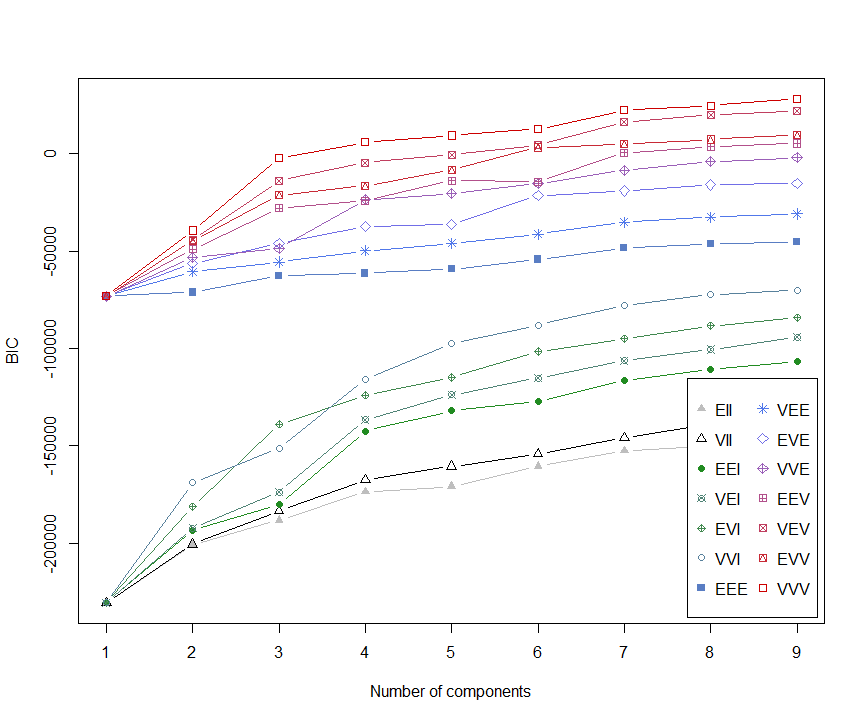</center>

Per quasi tutti i modelli, il BIC continua ad aumentare fino a 9 componenti, senza un massimo netto o un “gomito” evidente. Questo non va bene, perchè il modello continua a migliorare aggiungendo componenti quindi non emerge un numero “naturale” di cluster (in altre parole il BIC non cresce e diminuisce come ci aspetteremmo). Inoltre, il modello migliore per l'algoritmo, non solo è quello con il massimo numero di componenti ma anche quello che prevede la struttura di covarianza più complessa. Da questo concludiamo che il GMM non è un buon approccio per individuare cluster ben definiti.

Per completezza dell'analisi riportiamo qui di seguito i plot:

<center>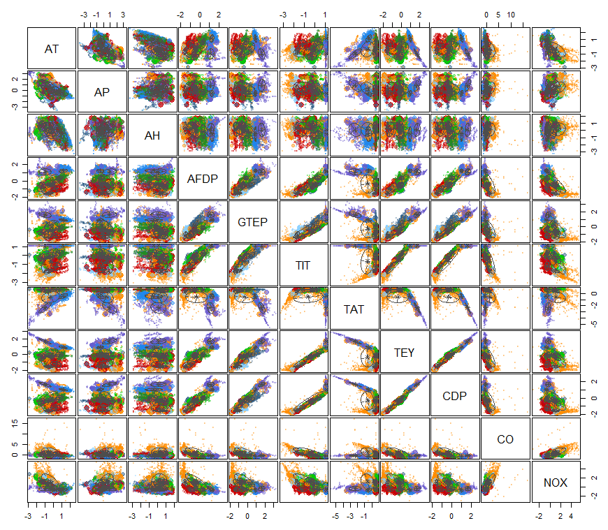</center>

<center>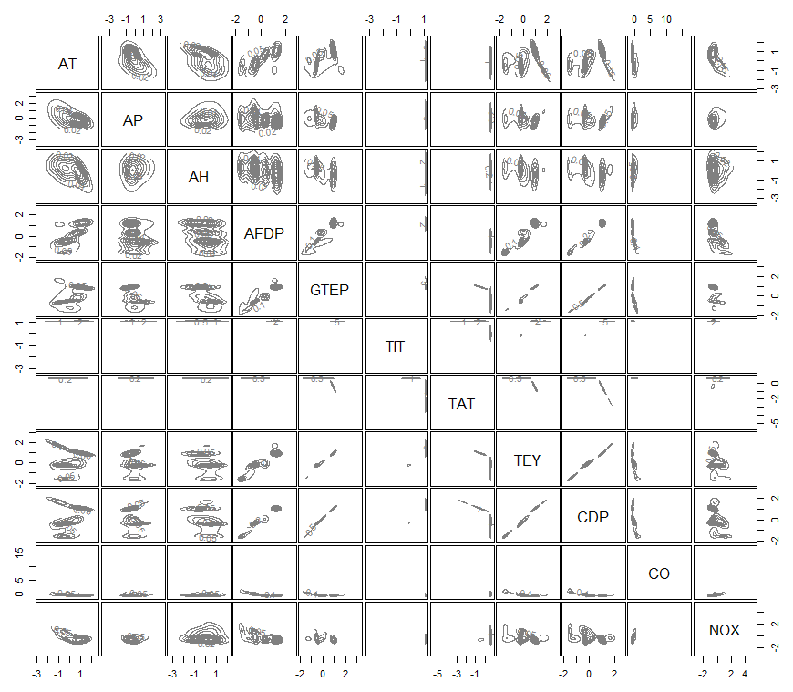</center>

Quest'ultimo riporta i grafici delle densità bivariate per ogni coppia di variabili stimate dal GMM.

Concludiamo che i dati NON sono ben descrivibili come una miscela di gaussiane finite.

### McLust sui dati trasformati

Nella paragrafo [Densità](#densità) è possibile vedere e confrontare le distribuzioni originali delle variabili del dataset. Dalla matrice dei plot possiamo notare come alcune delle distribuzioni quali AT, AP ed AH siano quasi gaussiane. Mentre altre variabili (in particolare CO e NOX) presentano forti **asimmetrie** che rendono le distribuzioni lontate da quella di una normale, motivo per cui abbiamo optato per una loro trasformazione (*logaritmica*) nel tentativo di simmetrizzarle e ripetere l'analisi con i dati trasfromati. Per le variabili che presentano multimodalità purtroppo c'è poco da fare, perchè qualsiasi trasfromazione non andrà a modificare la natura delle distribuzioni.

```{r}
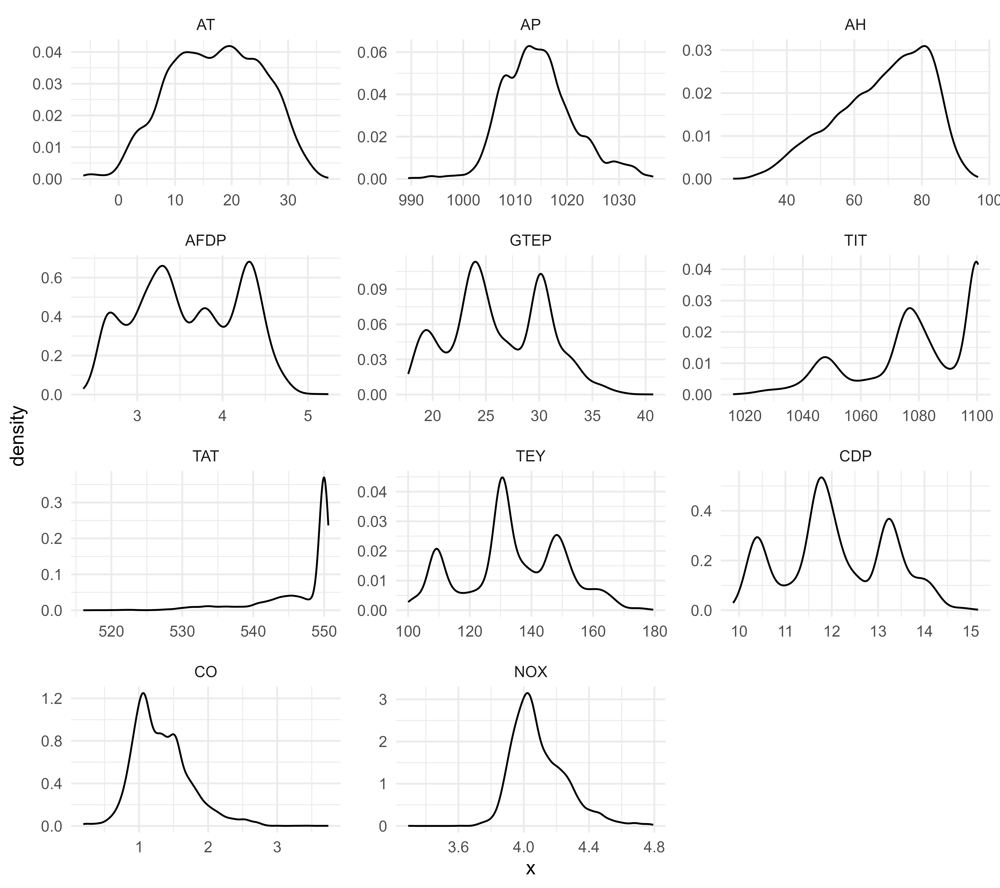
```

Confrontando i plot prima e dopo appare evidente come la trasformazione logaritmica abbia migliorato le distribuzioni di CO e NOX, in particolare quest'ultima, diventando praticamente simmetrica, mentre la asimmetrica di CO è diminuita e di parecchio.

I risultati ottenuti purtroppo non migliorano la situazione di prima, l'output ottenuto infatti è il seguente:

*Mclust VVV (ellipsoidal, varying volume, shape, and orientation) model with 9 components:*

```{r}
kable(
  tab_modello2,
  caption = "Indicatori del Gaussian Mixture Model"
)

kable(
  tab_cluster_oriz2,
  caption = "Distribuzione delle osservazioni nei cluster"
)
```

<center>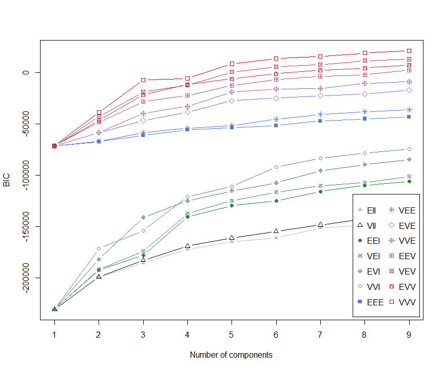</center>

### McLust su spazio ridotto

Si è voluto tentare un ultimo approccio prima di gettare la spugna, ovvero eseguire la funzione McLust nello spazio a dimensionalità ridotta ottenuto eseguendo la PCA (e su cui abbiamo già fatto k-means, k-median ecc.). Così facendo si ottiene un miglioramento marginale ma comunque non soddisfacente:

*Mclust VVV (ellipsoidal, varying volume, shape, and orientation) model with 8 components:*

```{r}
kable(
  tab_modello3,
  caption = "Indicatori del Gaussian Mixture Model"
)

kable(
  tab_cluster_oriz3,
  caption = "Distribuzione delle osservazioni nei cluster"
)
```

<center>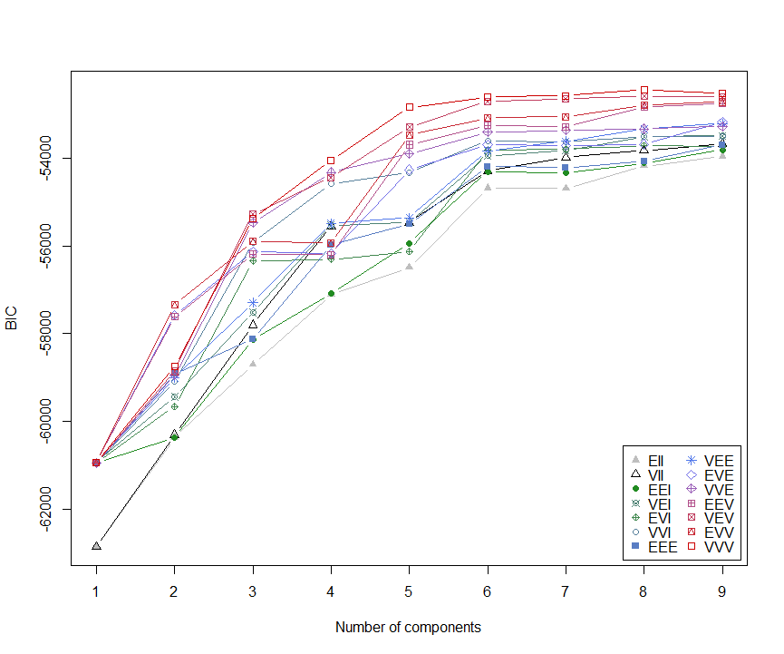</center>

## JDR (Joint Data Reduction)

Al contrario della Tandem Analysis qui la riduzione dimensionale ed il clustering sono stimati congiuntamente, ottimizzando entrambi. Lo spazio a dimensionalità ridotta considerato è, infatti, ottimizzato per la separazione dei cluster.

### Reduced K-means (RKM)

<center>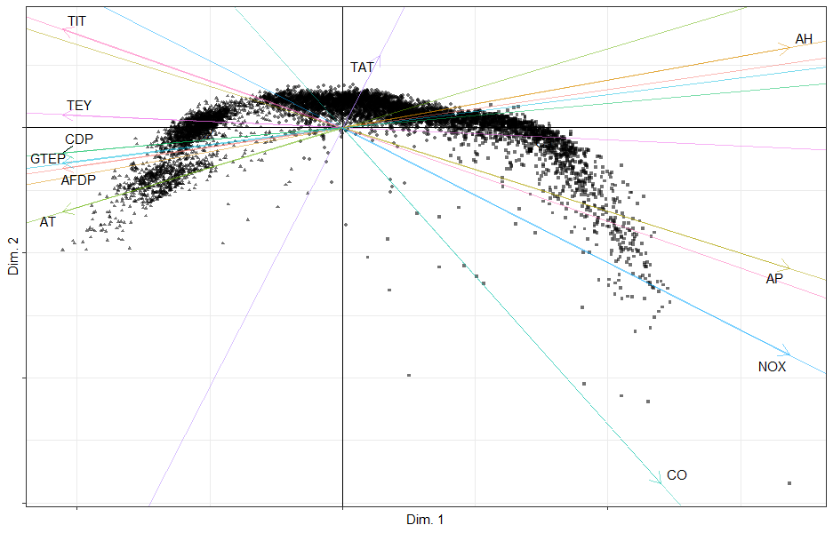</center>

La figura mostra in uno spazio bidimensionale la sepreazione delle proiezioni delle unità in 3 cluster, rappresentati da una diversa figura geometrica. Più il rapporto esistente tra le nuove dimensioni e le variabili originali.

Per migliorare la compresione riportiamo anche il grafico costruito con ggplot:

```{r, fig.align="center", fig.width=10, fig.height=6, echo=FALSE}
graficoRKM
```

Sebbene i cluster appaiano ben distinti, la riduzione dimensionale operata da questa tecnica crea "continuità" tra i gruppi come ad indicare una mancata separazione netta tra i cluster che osserviamo nel caso della semplice PCA.

### Factorial k-means

<center>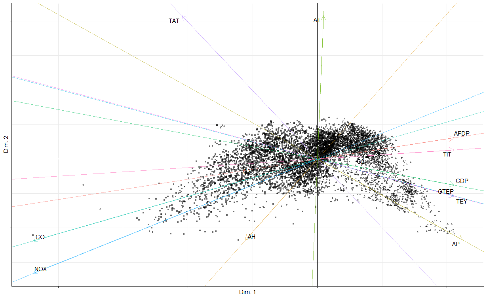</center>

Anche in questo caso il significato del grafico è analogo a quello precente. Ancora, per rendere chiari i risultati riportiamo il grafico ottenuto su ggplot:

```{r, fig.align="center", fig.width=10, fig.height=6, echo=FALSE}
graficoFKM
```

il Factorial K-means sembrebbe separare meglio i cluster rispetto ad una PCA combinata ad un k-means. Tralasciando la sovrapposizione di alcuni punti, la distizione tra un cluster e l'altro è netta. I gruppi appaiono infatti distinti e compatti. Per il clustering questa tecnica è molto indicata, sebbene la PCA ci permetta di interpretare in modo migliore i risultati ottenuti.
